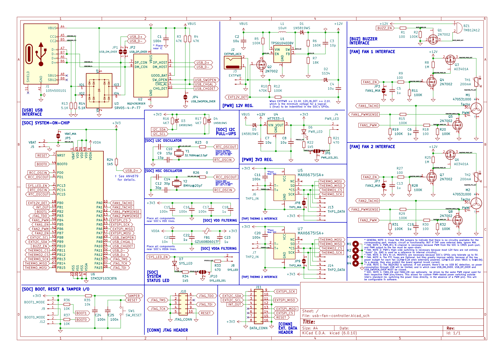

# mixfan-hardware

Hardware for the Mixfan, an USB-connected and powered 12V fan controller, that uses as much stock/cheap parts as possible. 

> TODO: PCB layout

Schematics: [docs/production/usb-fan-controller.pdf](docs/production/usb-fan-controller.pdf)

